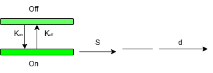

# Unraveling the Impact of Gene Length on Kinetic Parameters: Implications in Drug Target selection
 <!-- Add this line with the correct path -->

 <!--***Flowchart of the pipeline of our whole work** <!-- Add your description -->


 <!----> <!-- Add this line with the correct path -->

<!--***Pipeline of the mutual information-based feature reduction technique**--> <!-- Add your description -->


<br />
<div align="center">
  
<h3 align="center"Unraveling the Impact of Gene Length on Kinetic Parameters: Implications in Drug Target selection</h3>

 
</div>


<!-- TABLE OF CONTENTS -->
<details>
  <summary>Table of Contents</summary>
  <ol>
    <li>
      <a href="#about-the-project">About The Project</a>
      <ul>
        <li><a href="#built-with">Built With</a></li>
      </ul>
    </li>
    <li>
      <a href="#getting-started">Getting Started</a>
      <ul>
        <li><a href="#prerequisites">Prerequisites</a></li>
        <li><a href="#installation">Installation</a></li>
        <li><a href="#how_to_run">How to run</a></li>
      </ul>
    </li>
    <li><a href="#usage">File details and workflow of the project</a></li>
    <li><a href="#license">License</a></li>
    <li><a href="#contact">Contact</a></li>
    
  </ol>
</details>


<!-- ABOUT THE PROJECT -->
## About The Project

Gene expression is a multifaceted process crucial to understanding molecular biology and pharmacology. Our research focuses on elucidating the intricate relationship between gene
length and kinetic parameters, such as 𝑆𝑖, 𝐾𝑜𝑛, 𝐾𝑜𝑓 𝑓 , and 𝑆𝐾𝑜𝑓 𝑓 , which significantly influence the mean expression levels of genes.Using a two-state stochastic gene expression model
implemented in Python, we analyzed single-cell transcriptomics data to predict kinetic parameters for each gene. We classified genes into short and long categories, revealing distinct
patterns in the relationship between gene length and these parameters. Our results indicate that burst size plays a critical role in mean expression, highlighting its importance for identifying gene targets that require lower drug doses for therapeutic effects.


<p align="right">(<a href="#top">back to top</a>)</p>


### Built With

* Python 3.6
* sklearn


<p align="right">(<a href="#top">back to top</a>)</p>


<!-- GETTING STARTED -->
## Getting Started

These are the steps to follow and run this project:
### Prerequisites


* pip install all the required libraries.
  

### Installation


1. Clone the repo
   ```sh
   git clone https:https://github.com/soham2-4/Hierarchical-Bayesian-model-for-genes.git
   ```
2. Install pip packages
   ```sh
   pip3 install ....
   ```
3. Run python files in code folder
   ```sh
   python run_poisson_beta.py (get the result txt)
  
   ```

  
<p align="right">(<a href="#top">back to top</a>)</p>


<!-- USAGE EXAMPLES -->
## File Details and workflow of the project

* Datasets: Three datasets are given in the Datasets folder. 


<p align="right">(<a href="#top">back to top</a>)</p>


<!-- LICENSE -->
## License

Distributed under the MIT License. See `LICENSE` for more information.

<p align="right">(<a href="#top">back to top</a>)</p>


<!-- CONTACT -->
## Contact

Your Name - Soham Choudhuri - soham.choudhuri@research.iiit.ac.in

Project Link: [https://github.com/soham2-4/Hierarchical-Bayesian-model-for-genes/tree/main](https://github.com/soham2-4/Hierarchical-Bayesian-model-for-genes/tree/main)

<p align="right">(<a href="#top">back to top</a>)</p>


